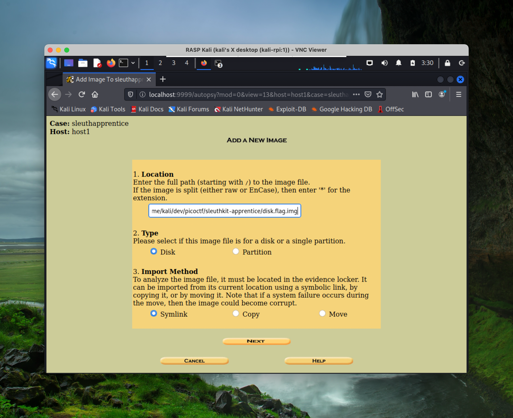
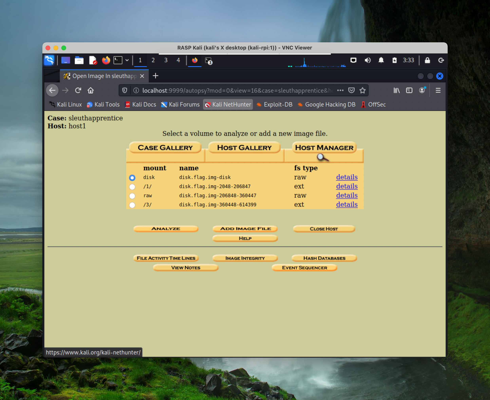

# PicoCTF 2022 Sleuthkit Apprentice writeup

The Problem is the following:


### Download & extract the image

Run the following command:

```shell
wget https://artifacts.picoctf.net/c/336/disk.flag.img.gz
gunzip disk.flag.img.gz
```

a file named `disk.flag.img` should show up at your working directory.

### Finding the flag with autopsy

In the following steps, I will demonstrate how to extract the key with [autopsy](https://www.autopsy.com/), the graphical user interface for [sleuthkit](https://www.sleuthkit.org/). This tool is built into kali linux.

First, run `autopsy` and open `localhost:9999/autopsy`

Use the graphical user interface to open a new case, and click through the default options until "Add A New Image":

fill in the absolute path of the image downloaded(use `pwd` to get your current directory)



again, click through the default options until this page:



After some digging, you'll find that in conducting file analysis in /3/, when you search for the text `flag`,  there are two files, one of which is deleted, the other is encoded.


Next, click on display Hex value, and you'll find the flag:


The flag is: `picoCTF{by73_5urf3r_25b0d0c0}`
